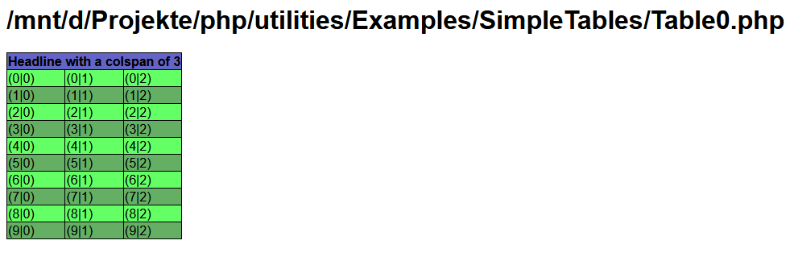
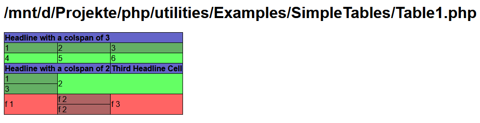

# Utilities

A collection of utility classes.
See the [utilities-wiki](https://github.com/phoenixTFM/utilities/wiki) for more information and hints.

### Examples: SimpleTable

## Built With

* PHP-Version - [7.4.2](https://www.php.net/ChangeLog-7.php)
* IDE - [PHPStorm](https://www.jetbrains.com/phpstorm/)
* Dependency Management - [Composer](https://getcomposer.org/)

## Authors

* **Thomas Merk** - *Initial work* - [phoenixTFM](https://github.com/phoenixTFM)

See also the list of [contributors](https://github.com/phoenixTFM/squid-draw/graphs/contributors) who participated in this project.
